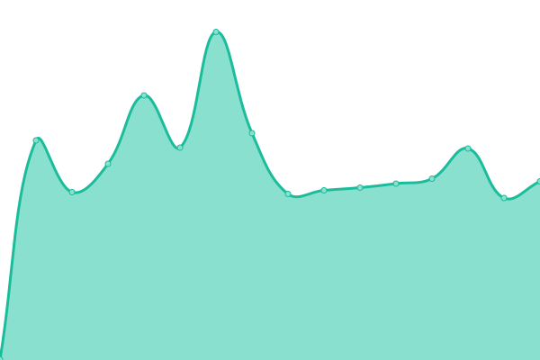
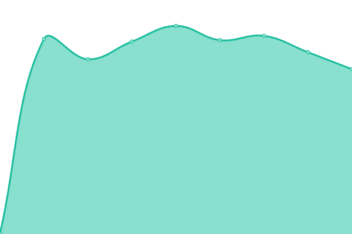

# [📈 Live Status](https://axinjanet.github.io/upptime/): <!--live status--> **🟧 Partial outage**

This repository contains the open-source uptime monitor and status page for [axinjanet](https://axinjanet.github.io/upptime/), powered by [Upptime](https://github.com/upptime/upptime).

With [Upptime](https://upptime.js.org), you can get your own unlimited and free uptime monitor and status page, powered entirely by a GitHub repository. We use [Issues](https://github.com/axinjanet/upptime/issues) as incident reports, [Actions](https://github.com/axinjanet/upptime/actions) as uptime monitors, and [Pages](https://axinjanet.github.io/upptime/) for the status page.

<!--start: status pages-->
<!-- This summary is generated by Upptime (https://github.com/upptime/upptime) -->
<!-- Do not edit this manually, your changes will be overwritten -->
<!-- prettier-ignore -->
| URL | Status | History | Response Time | Uptime |
| --- | ------ | ------- | ------------- | ------ |
|  [axinja cloud main](https://www.axinja.cloud) | 🟩 Up | [axinja-cloud-main.yml](https://github.com/axinjanet/upptime/commits/HEAD/history/axinja-cloud-main.yml) | 

 495ms
     
 | 

<a href="https://axinjanet.github.io/upptime/history/axinja-cloud-main">100.00%</a>
    

|  tea.axinja.cloud | 🟥 Down | [tea-axinja-cloud.yml](https://github.com/axinjanet/upptime/commits/HEAD/history/tea-axinja-cloud.yml) | 

 1721ms
     
 | 

<a href="https://axinjanet.github.io/upptime/history/tea-axinja-cloud">99.64%</a>
    

|  blitzen.axinja.net | 🟥 Down | [blitzen-axinja-net.yml](https://github.com/axinjanet/upptime/commits/HEAD/history/blitzen-axinja-net.yml) | 

 985ms
     
 | 

<a href="https://axinjanet.github.io/upptime/history/blitzen-axinja-net">99.69%</a>
    

|  topmail.cc | 🟥 Down | [topmail-cc.yml](https://github.com/axinjanet/upptime/commits/HEAD/history/topmail-cc.yml) | 

 471ms
     
 | 

<a href="https://axinjanet.github.io/upptime/history/topmail-cc">99.75%</a>
    

<!--end: status pages-->

## 📄 License

- Powered by: [Upptime](https://github.com/upptime/upptime)
- Code: [MIT](./LICENSE) © [axinjanet](https://axinjanet.github.io/upptime/)
- Data in the `./history` directory: [Open Database License](https://opendatacommons.org/licenses/odbl/1-0/)
